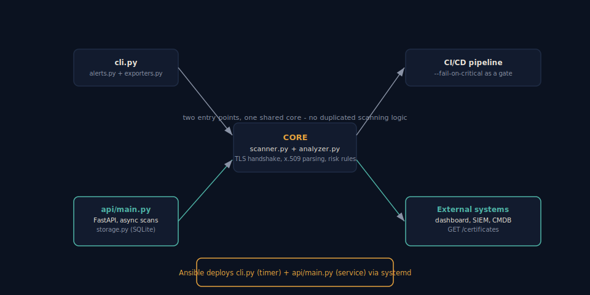

# ssl-cert-scanner


A Python tool to discover, analyze, and monitor SSL/TLS certificates
across a network. Detects certificates that are expiring soon,
self-signed, signed with weak algorithms, or using undersized keys,
and exports the results as JSON/CSV for integration with a SIEM, a
CMDB, or any certificate management platform.

Ships as three things, not just a script:

- A **CLI** for ad-hoc scans and CI/CD gates.
- A **REST API** (FastAPI) so the scanner can be triggered on demand
  and its results queried by other systems - a feature of a platform,
  not a one-off tool.
- An **Ansible playbook** that deploys it as a real service: the API
  running under systemd, plus a scheduled scan job running twice a day.



## What it does

- **Discovery**: scans single hosts, domains, or full CIDR ranges
  (`192.168.1.0/24`) on common TLS ports (443, 8443, 993, 995, 465,
  636...), in parallel using a thread pool.
- **x.509 analysis**: extracts subject, issuer, SAN, validity dates,
  signature algorithm, key size, serial number, and SHA-256 fingerprint.
- **Risk detection**:
  - expired or soon-to-expire certificates (configurable thresholds)
  - weak signature algorithm (`md5`, `sha1`)
  - RSA key below 2048 bits
  - self-signed certificate
- **Console report** colored by severity.
- **Export** to JSON and CSV.
- **CI/CD mode**: `--fail-on-critical` returns exit code 1 if anything
  critical is found, so it can be used as a pipeline gate.
- **REST API**: trigger scans asynchronously, poll for results, query
  the latest known state of every certificate ever scanned.
- **Automated deployment**: one Ansible playbook turns a fresh
  Debian/Ubuntu host into a running scanner service.

## Installation

```bash
git clone <your-repo>
cd ssl-cert-scanner
python3 -m venv .venv && source .venv/bin/activate
pip install -r requirements.txt
```

## CLI usage

```bash
# A single host
python -m ssl_cert_scanner --host example.com

# A range on your local network
python -m ssl_cert_scanner --cidr 192.168.1.0/28 --ports 443,8443

# List of targets from a file + export a report
python -m ssl_cert_scanner --targets examples/targets.txt --json report.json --csv report.csv

# As a CI/CD gate: fail the build if there are critical certificates
python -m ssl_cert_scanner --targets examples/targets.txt --fail-on-critical
```

Example output:

```
HOST                           PORT    DAYS   STATUS     FLAGS
-----------------------------------------------------------------------------------------------
expired.local                  993     -6     expired    EXPIRED, SELF_SIGNED
critical.local                 8443    2      critical   CRITICAL_EXPIRY, SELF_SIGNED
warning.local                  443     19     warning    WARNING_EXPIRY, SELF_SIGNED
ok.local                       443     179    ok         SELF_SIGNED
-----------------------------------------------------------------------------------------------
Total: 4 | Expired: 1 | Critical: 1 | Warning: 1 | OK: 1
```

## REST API

```bash
pip install -r requirements.txt -r requirements-api.txt
uvicorn api.main:app --reload
```

```bash
# Trigger a scan (returns immediately, runs in the background)
curl -X POST http://localhost:8000/scans \
  -H "Content-Type: application/json" \
  -d '{"targets": ["example.com"], "ports": [443]}'
# -> {"scan_id": "...", "status": "pending"}

# Poll for the result
curl http://localhost:8000/scans/<scan_id>

# Latest known state of every certificate ever scanned
curl http://localhost:8000/certificates?status=critical
```

Interactive docs (Swagger UI) are available at `http://localhost:8000/docs`
once the server is running.

See [`api/main.py`](api/main.py) for the full endpoint list.

## Automated deployment (Ansible)

```bash
cd ansible
ansible-playbook -i inventory.ini deploy.yml \
  --extra-vars "repo_url=https://github.com/<your-username>/ssl-cert-scanner.git"
```

This installs the scanner on the target host(s) and sets up:

- `ssl-cert-scanner-api.service` - the REST API, running under systemd,
  restarted automatically on failure.
- `ssl-cert-scanner-scan.timer` - a scheduled scan (twice a day by
  default, configurable via `scan_schedule`), writing a JSON report to
  `/var/log/ssl-cert-scanner/`.

## Tests

```bash
pip install -r requirements.txt -r requirements-dev.txt

# Core analyzer tests (no external dependencies, run anywhere)
python -m pytest tests/test_analyzer.py -v

# API tests (require requirements-api.txt to be installed too)
pip install -r requirements-api.txt
python -m pytest tests/test_api.py -v
```

The analyzer tests generate self-signed certificates **in memory**
(no network or live TLS server required). The API tests spin up the
FastAPI app in-process with `TestClient` and exercise the full
scan -> poll -> result flow against a throwaway database.

## CI/CD

Every push and pull request runs through GitHub Actions
([`.github/workflows/ci.yml`](.github/workflows/ci.yml)):

1. Lint with `ruff`.
2. Run the core test suite across Python 3.10, 3.11, and 3.12.
3. Run the API test suite.

## Repository structure

```
ssl-cert-scanner/
|-- ssl_cert_scanner/
|   |-- scanner.py      # network discovery + TLS handshake
|   |-- analyzer.py     # x.509 parsing and risk rules
|   |-- alerts.py       # console report by severity
|   |-- exporters.py    # JSON / CSV
|   `-- cli.py          # command-line entry point
|-- api/
|   |-- main.py         # FastAPI app
|   |-- schemas.py      # request/response models
|   `-- storage.py      # SQLite persistence for scans/results
|-- ansible/
|   |-- deploy.yml      # playbook
|   |-- inventory.ini
|   `-- templates/      # systemd unit files
|-- .github/workflows/ci.yml
|-- tests/
|   |-- test_analyzer.py # offline tests with in-memory certificates
|   `-- test_api.py      # API tests via FastAPI TestClient
|-- examples/targets.txt
`-- docs/architecture.svg
```

## Possible extensions

- Email/Slack/webhook notifications when a critical certificate appears.
- Compare against a historical database to detect unexpected issuer
  changes (a possible sign of a MITM).
- Native Prometheus exporter (`days_until_expiry` metric).
- Authentication on the API (API key or OAuth2) before exposing it
  beyond a trusted network.

## License

MIT.
